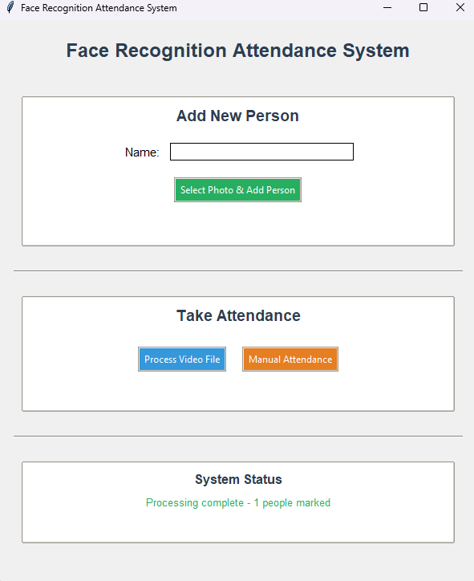

# Face-Based Attendance System

A simple and efficient attendance tracking system using face recognition technology built with Python, OpenCV, and face_recognition library.

## 📸 Demo



*Face Recognition Attendance System - Main Interface*

## 🚀 Installation Guide

### Step 1: Create New Anaconda Environment
```bash
# Create new environment with Python 3.8 (better compatibility)
conda create -n face_attendance python=3.8 -y

# Activate environment
conda activate face_attendance
```

### Step 2: Install Dependencies in Correct Order
```bash
# Install CMake first
conda install -c conda-forge cmake -y

# Install dlib 
conda install -c conda-forge dlib -y

# Install other dependencies
conda install -c conda-forge opencv -y
pip install face_recognition

# Install GUI libraries
pip install pillow
```

## 🎯 How to Use

### 1. Run the Application
```bash
# Navigate to project directory
cd C:\Users\Saleh\Desktop\face_attendance_ai

# Run the application
python attendance.py
```

### 2. Add New Person
1. Enter the person's name in the text field
2. Click "Select Photo & Add"
3. Choose a clear photo of the person's face
4. Click "Open" to add them to the system

### 3. Take Attendance

**Option A: Video File Processing**
1. Click "Select Video File"
2. Choose a video file containing people
3. The system will automatically recognize faces and mark attendance
4. Press 'q' to stop the video processing

**Option B: Manual Attendance**
1. Click "Manual Attendance"
2. Select a person from the list
3. Click "Mark Attendance" to record their presence

### 4. View Attendance
- Today's attendance is displayed in the text area
- Attendance records are saved in `attendance.json`

## 📋 Features

- **Face Recognition**: Automatically recognizes registered faces
- **Video Processing**: Process video files for attendance
- **Manual Attendance**: Manually mark attendance from registered list
- **Attendance Tracking**: Records date and time of attendance
- **Simple GUI**: Easy-to-use interface with tkinter
- **Data Persistence**: Saves attendance records to JSON file
- **Visual Feedback**: Shows recognized faces with green rectangles

## 🔧 Technical Details

### Requirements
- Python 3.8
- OpenCV
- face_recognition library
- dlib
- tkinter (built-in)
- PIL/Pillow

### File Formats Supported
- **Images**: .jpg, .png, .jpeg
- **Videos**: .mp4, .avi, .mov, .mkv
- **Data Storage**: JSON format

## 🎨 Interface Components

1. **Add Person Section**: Name input and photo selection
2. **Attendance Section**: Video file selection and manual attendance
3. **Status Display**: Shows current system status
4. **Attendance List**: Displays today's attendance records

## 📊 Data Storage

### Face Images
- Stored in `faces/` directory
- Named as `{person_name}.jpg`
- Used for face recognition training

### Attendance Records
- Stored in `attendance.json`
- Format: `{date: {name: time}}`
- Example:
```json
{
  "2024-01-15": {
    "saleh": "09:30",
    "another saleh": "09:45"
  }
}
```

## 🔍 Troubleshooting

### Common Issues

1. **Video not processing**: Check if video file format is supported
2. **Face not recognized**: Ensure good lighting and clear face visibility in photos
3. **Installation errors**: Follow the exact installation order in Step 2

### Tips for Better Recognition
- Use clear, well-lit photos for registration
- Ensure face is clearly visible in videos
- Use high-quality video files for better accuracy
- Register multiple photos per person for better recognition

## 🎯 Usage Tips

1. **Photo Quality**: Use high-quality, well-lit photos for registration
2. **Video Quality**: Use clear videos with good lighting for processing
3. **Manual Backup**: Use manual attendance for backup or when video processing fails
4. **Regular Updates**: Re-register faces if recognition accuracy decreases


Created for educational and practical attendance tracking purposes.

---
**Note**: Make sure to activate the conda environment (`conda activate face_attendance`) before running the application each time.
